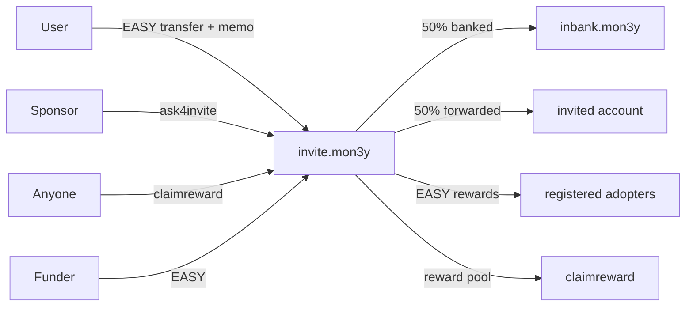

# EASY Invite — UI integration guide

Reference for building a frontend against the on-chain program. Contracts deploy to **`invite.mon3y`** (easyinvite) and **`inbank.mon3y`** (inbank passthrough).

| Account | Role |
|---------|------|
| `invite.mon3y` | Main contract: registration, invites, rewards, config |
| `inbank.mon3y` | Vault for banked invite EASY; only accepts controlled transfers |
| `mon3y` | EASY token issuer (`transfer` action) |
| `reflections` | Default inviter when the payer is not yet registered (configurable) |

Token: **EASY** — symbol `EASY`, precision **6** (e.g. `200.000000 EASY` → amount `200000000`).

---

## High-level flows



1. **Paid invite** — User sends EASY to `invite.mon3y` via `mon3y::transfer` with a structured memo. On a **first welcome**, the contract registers the invited account, bumps invite scores up the upline, banks half of the payment to `inbank.mon3y`, and forwards the other half to the invited user (minimum `config.min_invite_amount`, default 200 EASY). On a **Welcome Back** (invited account already in `adopters`), the same 50/50 token flow still runs, but only `invitedby` (and `lastupdated`) change — and the transfer must be at least **200 EASY × the invited account's tetrahedral level** (level is computed from the **purchased** account's `score`, minimum level is 1).
2. **Queue invite** — User calls `ask4invite` to join a FIFO queue. A later paid invite with memo prefix `*|` consumes the oldest queue entry. Queue rows for accounts already in `adopters` are skipped or removed automatically.
3. **Claim rewards** — Anyone may call `claimreward` (no parameters, no special auth). Contract pays adopters from EASY held on `invite.mon3y`, weighted by their `banked` amount and tetrahedral level, using `inbank.mon3y` balance as the weighting denominator.

---

## Reading chain state

All easyinvite tables use **code** = `invite.mon3y`, **scope** = `invite.mon3y`.

### Singletons

| Table | Row | Use in UI |
|-------|-----|-----------|
| `config` | Single `config` row | Min invite amount, enabled flag, admin, claim pagination, token/inbank accounts |
| `stats` | Single `stats` row | Global counters (see below) |

| Field | Meaning |
|-------|---------|
| `total_invite_score` | +1 per upline `score += 1` on each **first** paid welcome (not on re-welcome) |
| `total_users` | +1 per new `adopters` row (first welcome only) |
| `total_rewards_distributed` | +reward amount each time `claimreward` pays someone |
| `last_registered` | Account from the most recent registration |

Example (pseudo):

```js
const config = await api.getTableRows({
  code: 'invite.mon3y',
  scope: 'invite.mon3y',
  table: 'config',
  limit: 1,
});
```

Default config values (before `setconfig` on a fresh deploy) are defined in code:

| Field | Default |
|-------|---------|
| `enabled` | `true` |
| `max_invite_depth` | `5` |
| `claim_limit` | `100` |
| `min_invite_amount` | `200.000000 EASY` |
| `token_contract` | `mon3y` |
| `reflections_account` | `reflections` |
| `inbank_account` | `inbank.mon3y` |

### `adopters` table

One row per registered user.

| Field | Type | Meaning |
|-------|------|---------|
| `account` | name | User account (primary key) |
| `invitedby` | name | Direct inviter (updated on every paid welcome, including re-welcome) |
| `lastupdated` | uint32 | Unix timestamp of last invite-related update (registration, score bump, or re-welcome) |
| `score` | uint32 | Invite score (upline increments on **first** welcome only) |
| `banked` | asset | Cumulative EASY credited from paid invites (inviter’s half) |

Secondary index **`byscore`** — sort key `UINT32_MAX - score` (higher scores first). Use for leaderboards.

**Check if registered:** `getTableRows` with `lower_bound` / `get_table_account` on primary key = account name.

### `invrequests` table

FIFO queue for “pay for next person in line” invites.

| Field | Type | Meaning |
|-------|------|---------|
| `account` | name | Who wants an invite (primary key) |
| `requester` | name | Who submitted the request |
| `requested_at` | uint32 | Unix timestamp |

Secondary index **`bytime`** — ascending `requested_at`. Oldest request is consumed first when memo starts with `*|`.

When any paid invite completes for an account (first welcome or re-welcome), that account’s `invrequests` row is **deleted** if present. FIFO processing also drops queue heads that are already in `adopters` before picking the next entry.

### Balances (not in easyinvite ABI)

Read EASY balances from **`mon3y`** token contract `accounts` table:

| Account | UI purpose |
|---------|------------|
| `invite.mon3y` | Reward pool — funds distributed by `claimreward` |
| `inbank.mon3y` | Banked pool — denominator for reward weighting |
| User wallet | Show spendable EASY for sending invites |

```js
// scope = token owner, code = mon3y
await api.getCurrencyBalance('mon3y', 'invite.mon3y', 'EASY');
await api.getCurrencyBalance('mon3y', 'inbank.mon3y', 'EASY');
```

---

## User actions

Contract account for all actions below: **`invite.mon3y`**. ABI: `easyinvite.abi`.

### Paid invite (token transfer)

**Action:** `mon3y::transfer`  
**From:** payer’s account  
**To:** `invite.mon3y`  
**Quantity:** ≥ `config.min_invite_amount`  
**Memo:** see formats below  

Requirements:

- Transfer must arrive via `config.token_contract` (default `mon3y`)
- `config.enabled` must be `true`
- Invited account cannot equal payer
- Memo must contain `|`
- Amount ≥ `config.min_invite_amount`

The invited account **may already be in `adopters`** (re-welcome / change inviter). Requirements then differ:

| Welcome type | Minimum transfer |
|--------------|------------------|
| First welcome | `config.min_invite_amount` (default 200 EASY) |
| Welcome Back (already in `adopters`) | **200 EASY × invited account tetrahedral level** (min 200 EASY) |

On re-welcome, tokens are still split and forwarded as usual, the payer’s `banked` increases, and the invited user’s `invitedby` is set to the paying inviter (see **Inviter resolution**). Upline `score` bumps and `stats.total_users` apply only on a **first** welcome.

#### Memo format A — direct invite

```
<invited_account>|<optional forward memo>
```

Examples:

- `alice|Welcome to EASY`
- `bob|` (empty forward memo is allowed after `|`)

The invited account receives **50%** of the transfer (rounded down on the banked half). The inviter’s `banked` field increases by the banked half, and that EASY is sent to `inbank.mon3y`.

**Inviter resolution:**

- If payer is already in `adopters` → payer is the inviter.
- If payer is not registered → `config.reflections_account` is the inviter (auto-registered if missing).

#### Memo format B — queue (FIFO)

```
*|<optional forward memo>
```

Uses the oldest row in `invrequests` (by `bytime`), skipping any head whose `account` is already in `adopters`. The chosen row is removed when the transfer is processed; the queued `account` becomes the invited user.

#### Welcome Back (change inviter)

Send the same `mon3y::transfer` to `invite.mon3y` with memo `{already_registered_account}|{message}` and quantity **≥ 200 EASY × that account's tetrahedral level** (from their invite score; minimum 200 EASY). Use this when a registered user should credit a **new** direct inviter. The UI should show the per-target cost clearly so users don’t attempt a too-small transfer and fail.

Errors the UI may surface:

| Message | Cause |
|---------|--------|
| `❇️ Sorry, registration is paused right now` | `config.enabled == false` |
| `Invite transfer is below configured minimum` | First welcome below `min_invite_amount` |
| `❇️ Welcome Back (opening floodgate to ... ) requires ...` | Invited account already in `adopters` but amount is below `200 EASY × invited account tetrahedral level` |
| `❇️ You can't invite yourself` | Invited account equals payer |
| `No pending invite requests` | Queue memo but empty queue (after skipping already-welcomed heads) |
| `Banked payer is not registered` | Payer could not be registered (should not occur after a valid transfer) |

### `ask4invite`

Join the paid-invite queue.

| Param | Type | Description |
|-------|------|-------------|
| `account` | name | Account that will receive the invite when funded |
| `requester` | name | Must sign the transaction (`require_auth(requester)`) |

```json
{
  "account": "alice",
  "requester": "alice"
}
```

Typically `account` and `requester` are the same; a sponsor can set `requester` to their own account.

### `claimreward`

Distribute one page of rewards. **No parameters.** Callable by **any** account (no `require_auth`).

```json
{}
```

Behavior:

- Requires `inbank.mon3y` EASY balance &gt; 0 and `invite.mon3y` EASY balance &gt; 0
- Scans up to `config.claim_limit` adopters starting at `config.claim_start_key` (pagination)
- For each eligible adopter, sends EASY from `invite.mon3y` to the adopter
- Increments `stats.total_rewards_distributed` per payout
- Updates `config.claim_start_key` for the next run (wraps to `0` at end of table)

**Eligibility per row:** `score > 0`, `banked.amount > 0`, correct symbol, tetrahedral position &gt; 0.

**Reward formula** (for estimates in UI):

```
position = tetrahedralLevel(score)   // see table below
weighted = banked.amount * position
reward   = (invite_balance * weighted) / inbank_balance
```

Tetrahedral levels (largest index `n` where `T(n) <= score`):

| position | T(n) |
|----------|------|
| 1 | 1 |
| 2 | 4 |
| 3 | 10 |
| 4 | 20 |
| 5 | 35 |
| … | … |

Transfer memo to recipients:  
`❇️ Level {position} reward! Thanks for living the EASY life with us ❇️`

**UI note:** Large networks need repeated `claimreward` calls until `claim_start_key` returns to `0` or no adopters qualify.

---

## Admin actions

### `setconfig`

| Param | Type | Notes |
|-------|------|-------|
| `admin` | name | Admin account for future updates |
| `enabled` | bool | Pause registration / queue |
| `max_depth` | uint16 | Invite upline depth (1–10) |
| `claim_limit` | uint32 | Adopters scanned per `claimreward` (1–1000) |
| `min_invite_amount` | asset | Minimum paid invite |
| `token_contract` | name | Token issuer (usually `mon3y`) |
| `reflections_account` | name | Default inviter |
| `inbank_account` | name | Bank vault (use `inbank.mon3y`) |

First call: must be authorized by `invite.mon3y` (`require_auth(get_self())`).  
Later calls: must be authorized by current `config.admin`.  
`claim_start_key` is preserved on updates (only changes via `claimreward`).

### `deleteuser`

Dev/maintenance only. **`require_auth(invite.mon3y)`** — not a normal user action.

```json
{ "user": "alice" }
```

---

## `inbank.mon3y` contract

No user-facing actions — behavior is entirely in the **`transfer` notification** handler.

| Incoming `from` | `get_first_receiver` | Result |
|-----------------|------------------------|--------|
| `invite.mon3y` | `mon3y` | **Accept** — balance stays on `inbank.mon3y` |
| `mon3y` (contract account) | `mon3y` | **Auto-forward** to `invite.mon3y` (same memo) |
| Any other account | `mon3y` | **No-op** — transfer succeeds; EASY stays on `inbank.mon3y` |
| Not `mon3y` notify | — | **Fail** — `only EASY mon3y is accepted here` |

Paid invites send the banked half **from `invite.mon3y`** → `inbank.mon3y` (memo `paid invite`).

---

## Suggested UI screens

### Registration / invite

- Show `config.enabled` and `min_invite_amount`
- Input: invited account + optional message → build memo `{account}|{message}`
- Button: `mon3y::transfer` → `invite.mon3y`
- If invited account is already in `adopters`, require **5×** `min_invite_amount` and explain that only `invitedby` updates (no duplicate registration)
- Optional: “Join queue” → `ask4invite` (only for accounts **not** yet in `adopters`)
- Optional: “Fund next in queue” → memo `*|{message}`

### Profile

- Load `adopters` row for connected account
- Show `invitedby`, `score`, `banked`, `lastupdated`
- Compute/display tetrahedral level from `score`
- Link upline chain (walk `invitedby` up to `max_invite_depth`)

### Rewards

- Show `invite.mon3y` EASY balance (pool) and `stats.total_rewards_distributed`
- Show `inbank.mon3y` EASY balance (weighting total)
- Estimate user share using formula above
- Button: `claimreward` with `{}` (any user can trigger a distribution round)

### Leaderboard

- `adopters` with index `byscore`, descending score

### Admin

- `setconfig` form (admin wallet only)
- Toggle `enabled` for maintenance mode

---

## Transaction examples (cleos)

Replace `USER` with the signing account.

```bash
# Paid invite: 200 EASY to register bob
cleos push action mon3y transfer \
  '["USER", "invite.mon3y", "200.000000 EASY", "bob|Welcome"]' \
  -p USER@active

# Join invite queue
cleos push action invite.mon3y ask4invite \
  '["USER", "USER"]' \
  -p USER@active

# Fund oldest queued account
cleos push action mon3y transfer \
  '["USER", "invite.mon3y", "200.000000 EASY", "*|Queue funded"]' \
  -p USER@active

# Welcome Back: change bob's inviter to USER (bob already registered; min = 200 EASY × payer level)
cleos push action mon3y transfer \
  '["USER", "invite.mon3y", "200.000000 EASY", "bob|Thanks again"]' \
  -p USER@active

# Run one claim page (any signer)
cleos push action invite.mon3y claimreward '{}' -p USER@active
```

---

## Integration checklist

- [ ] Load `config` + `stats` on app start
- [ ] Gate invite UI on `config.enabled`
- [ ] Format memos with `|`; validate invited account exists
- [ ] Support Welcome Back at **200 EASY × invited account tetrahedral level** for accounts already in `adopters`
- [ ] Refresh or hide `invrequests` after a welcome (row removed on-chain for that `account`)
- [ ] Use `getCurrencyBalance` for EASY on user, `invite.mon3y`, `inbank.mon3y`
- [ ] Detect registration via `adopters` primary key lookup
- [ ] Display `banked` + tetrahedral level + estimated claim share
- [ ] `claimreward` uses `{}` and any active permission is enough to sign
- [ ] Paginate or repeat `claimreward` until `claim_start_key` cycles
- [ ] Do not call `inbank` directly from UI — only `mon3y::transfer` / easyinvite actions

---

## ABI files

| Contract | Account | ABI |
|----------|---------|-----|
| easyinvite | `invite.mon3y` | `easyinvite.abi` |
| inbank | `inbank.mon3y` | *(no actions — notify-only)* |

For WharfKit / `@greymass/abi2json`, point the invite contract at `invite.mon3y` with `easyinvite.abi`.
